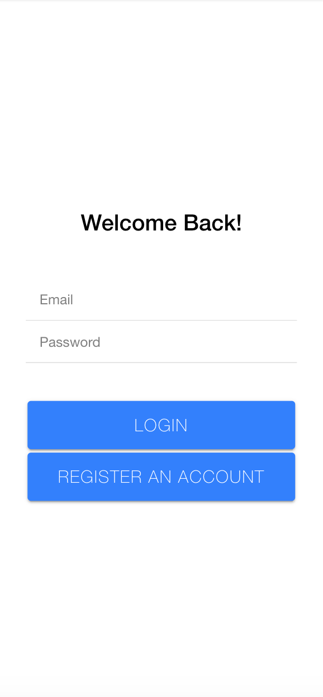
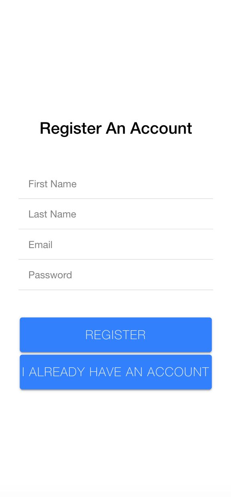
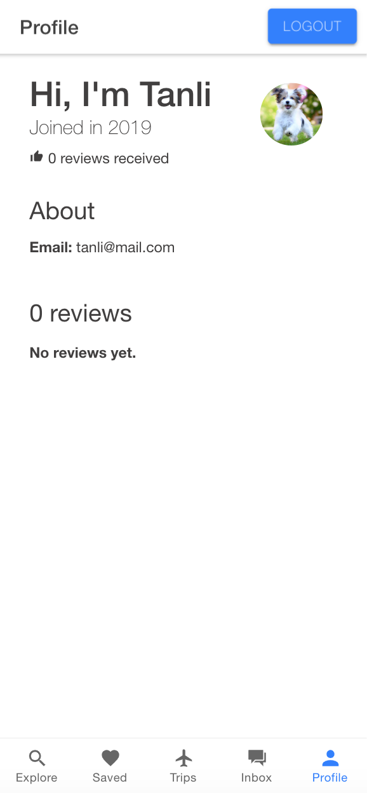
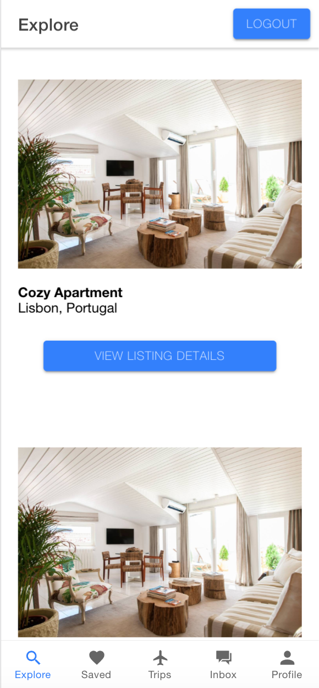
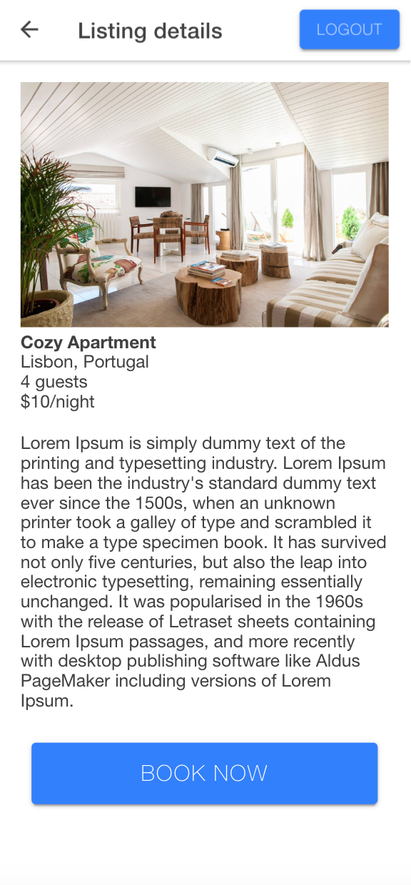
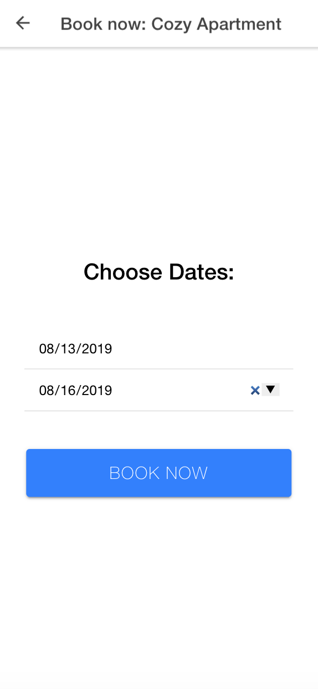

# Mock Airbnb Mobile App

## Table of Contents
+ [About](#about)
+ [Getting Started](#getting_started)
+ [Screenshots](#screenshots)

## About 
This project is a full stack mobile app inspired by Airbnb. The app allows guests to register an account, login/logout, view listings, and create bookings; all of this information is stored in a MySQL database.

## Getting Started 
- Clone the repository
- Install node modules
``npm install``
- run the API
``npm run dev``
- run the front-end
``ionic serve``

## Screenshots 

