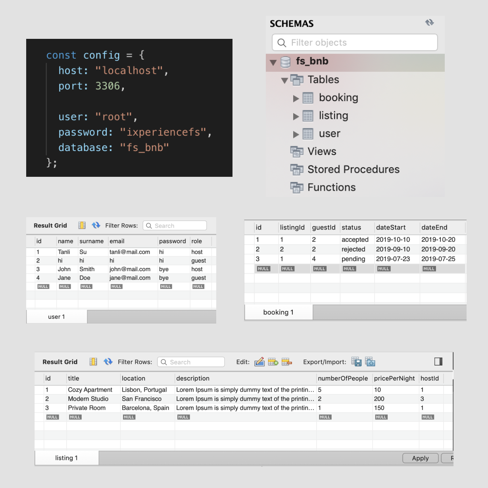

# Mock Airbnb Mobile App

## Table of Contents
+ [About](#about)
+ [Getting Started](#getting_started)
+ [Screenshots](#screenshots)

## About 
This project is a full stack mobile app inspired by Airbnb. The app allows guests to register an account, login/logout, view listings, and create bookings; all of this information is stored in a MySQL database.

## Getting Started 
- Clone the repository.
- Install node modules.
``npm install``
- Install Ionic.
``npm install -g ionic``
- Create an SQL database with sample data using MySQLWorkbench. Configure it as follows:

## How to Run 
- Run the API.
``npm run dev``
- In a separate terminal tab, run the front-end.
``ionic serve``

## Screenshots 

